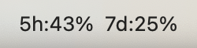
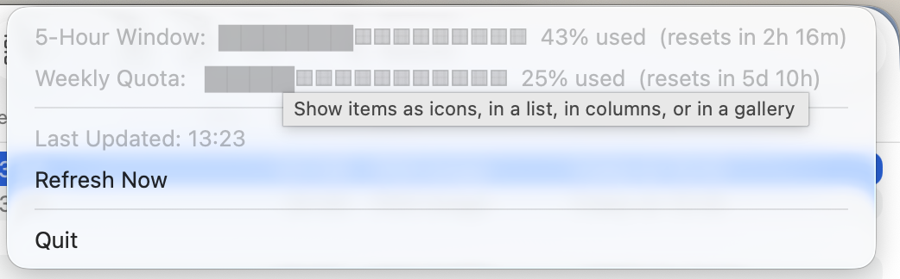

# claude-usage-menubar

A macOS menu bar widget that shows your Claude usage quota at a glance.



Shows two numbers in your menu bar:

- **5h** — the 5-hour rolling window (how much you've used in the current session window)
- **7d** — the 7-day weekly quota (cumulative usage over the past week)

Click it to see progress bars and time until each window resets.



## Prerequisites

- macOS
- Python 3.9+
- [Claude Code](https://docs.claude.com/en/docs/claude-code) installed and logged in with a Claude subscription (Pro, Max, Team, or Enterprise)

You must be authenticated via OAuth — this is the default when you select **"Claude account with subscription"** during `claude /login` in Claude Code.

## Install

```bash
git clone https://github.com/victor-shammas/claude-usage-menubar.git
cd claude-usage-menubar
pip3 install -r requirements.txt
```

If you get an `externally-managed-environment` error (common with Homebrew Python):

```bash
pip3 install --user --break-system-packages -r requirements.txt
```

## Run

```bash
python3 claude_menubar.py
```

## Run on login (recommended)

To start automatically and survive reboots:

```bash
# Edit the plist to match your Python and script paths
nano com.claude-usage-menubar.plist

# Install it
cp com.claude-usage-menubar.plist ~/Library/LaunchAgents/
launchctl load ~/Library/LaunchAgents/com.claude-usage-menubar.plist
```

To stop:

```bash
launchctl unload ~/Library/LaunchAgents/com.claude-usage-menubar.plist
```

## How it finds your token

The app checks these locations in order (first match wins):

1. `CLAUDE_OAUTH_TOKEN` environment variable
2. `~/.claude_menubar.json` — manual config: `{"oauth_token": "sk-ant-..."}`
3. `~/.claude/.credentials.json` — older Claude Code versions store credentials here
4. **macOS Keychain** — current Claude Code versions store credentials here under `"Claude Code-credentials"`

Most users don't need to do anything — if Claude Code is installed and logged in, option 4 just works.

### Token auto-refresh

Claude Code's OAuth access tokens expire after ~8 hours, and normally only Claude Code itself renews them. For sources 3 and 4 the app renews the token itself when it expires (or when a request comes back 401), using the refresh token stored alongside it, and writes the rotated credentials back to the same store so Claude Code stays logged in. This means the widget keeps working even when you haven't opened Claude Code in days.

Sources 1 and 2 are static tokens with no refresh token, so they still go stale — the app will show `err:401` when they do.

## How it works

The app polls an undocumented Anthropic endpoint (`api.anthropic.com/api/oauth/usage`) every 5 minutes. This is the same endpoint Claude Code's internal HUD uses. It returns utilization percentages for the 5-hour rolling window and 7-day weekly cap.

### Caveats

- The endpoint is **undocumented** and uses a versioned beta header (`anthropic-beta: oauth-2025-04-20`). If Anthropic updates this, the app will show an error until the header string is updated in the script.
- The `User-Agent` header must include `claude-code/<version>` to avoid aggressive rate limiting. The app detects your installed Claude Code version automatically.
- Each request is ~500 bytes. At one request per 5 minutes, that's about 140KB/day.

## Configuration

Edit these constants at the top of `claude_menubar.py`:

| Constant | Default | Description |
|---|---|---|
| `POLL_INTERVAL` | `300` | Seconds between refreshes |

## Troubleshooting

**"No token" in menu bar**

You're not logged into Claude Code via OAuth. Run:

```
claude /login
```

Select **"Claude account with subscription"** (option 1). This requires a Pro, Max, Team, or Enterprise plan.

**"re-auth" in menu bar**

The refresh token was rejected, so the app can't renew your access token. Re-authenticate with `claude /login`.

**"err:401" or "err:403"**

Your token is expired or invalid and couldn't be auto-refreshed (this is expected for static tokens from `CLAUDE_OAUTH_TOKEN` or `~/.claude_menubar.json`). Re-authenticate with `claude /login`, or update your static token.

**"err:429"**

Rate limited. This usually happens if you restart the app many times in quick succession. Wait a few minutes and it will recover on the next auto-refresh.

**Python Dock icon showing**

Install `pyobjc-framework-Cocoa` (included in `requirements.txt`). The app uses it to hide the Dock icon. If it's not installed, everything works but you'll see the Python rocket in the Dock.

## License

MIT
