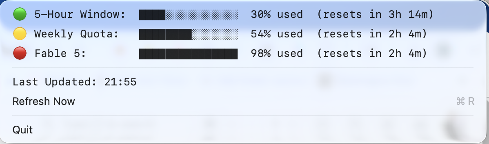

# claude-usage-menubar

A macOS menu bar widget that shows your Claude usage quota at a glance.


Shows your usage at a glance in the menu bar:

- **5h** — the 5-hour rolling window (how much you've used in the current session window)
- **7d** — the 7-day weekly quota (cumulative usage over the past week)
- **F5** — the weekly cap for a specific model (e.g. Fable 5), shown only when your plan enforces one

Click it to see progress bars and time until each window resets.



## Prerequisites

- macOS
- Python 3.9+
- [Claude Code](https://docs.claude.com/en/docs/claude-code) installed and logged in with a Claude subscription (Pro, Max, Team, or Enterprise)

You must be authenticated via OAuth — this is the default when you select **"Claude account with subscription"** during `claude /login` in Claude Code.

## Install

```bash
git clone https://github.com/victor-shammas/claude-usage-menubar.git
cd claude-usage-menubar
pip3 install -r requirements.txt
```

If you get an `externally-managed-environment` error (common with Homebrew Python):

```bash
pip3 install --user --break-system-packages -r requirements.txt
```

## Run

```bash
python3 claude_menubar.py
```

## Run on login (recommended)

To start automatically and survive reboots:

```bash
# Edit the plist to match your Python and script paths
nano com.claude-usage-menubar.plist

# Install it
cp com.claude-usage-menubar.plist ~/Library/LaunchAgents/
launchctl load ~/Library/LaunchAgents/com.claude-usage-menubar.plist
```

To stop:

```bash
launchctl unload ~/Library/LaunchAgents/com.claude-usage-menubar.plist
```

## How it finds your token

The app checks these locations in order (first match wins):

1. `CLAUDE_OAUTH_TOKEN` environment variable
2. `~/.claude_menubar.json` — manual config: `{"oauth_token": "sk-ant-..."}`
3. `~/.claude/.credentials.json` — older Claude Code versions store credentials here
4. **macOS Keychain** — current Claude Code versions store credentials here under `"Claude Code-credentials"`

Most users don't need to do anything — if Claude Code is installed and logged in, option 4 just works.

### Token auto-refresh

Claude Code's OAuth access tokens expire after ~8 hours, and normally only Claude Code itself renews them. For sources 3 and 4 the app renews the token itself when it expires, using the refresh token stored alongside it, and writes the rotated credentials back to the same store so Claude Code stays logged in. When both the file and the Keychain hold credentials, the app uses whichever has the most recent token.

Crucially, the app never calls the usage endpoint with a token it already knows is expired — that earns a long rate-limit ban (the endpoint answers an expired token with a `429` and a `Retry-After` up to an hour, not a clean `401`). It refreshes *first*, exactly once, and backs off on any `429`.

If its own refresh is rate limited (or its stored refresh token is stale), it falls back to launching `claude` in the background. Claude Code renews its OAuth token at startup — without a prompt, so no usage is consumed — and writes the fresh token to the Keychain, which the app then picks up. This is the automated version of the old "run `claude` once in a terminal" trick. The result: the widget self-heals on first launch and across logins, without you ever opening a terminal.

Sources 1 and 2 are static tokens with no refresh token, so they still go stale — the app will show `err:401` when they do.

## How it works

The app polls an undocumented Anthropic endpoint (`api.anthropic.com/api/oauth/usage`) every 5 minutes. This is the same endpoint Claude Code's internal HUD uses. It returns utilization percentages for the 5-hour rolling window and 7-day weekly cap, plus any per-model weekly caps (such as Fable 5) that apply to your plan. The 5-hour and 7-day figures are top-level fields; per-model caps arrive inside the response's `limits` array as `weekly_scoped` entries tagged with the model's display name, which is where the app reads the Fable 5 meter from.

### Caveats

- The endpoint is **undocumented** and uses a versioned beta header (`anthropic-beta: oauth-2025-04-20`). If Anthropic updates this, the app will show an error until the header string is updated in the script.
- The `User-Agent` header must include `claude-code/<version>` to avoid aggressive rate limiting. The app detects your installed Claude Code version automatically.
- Each request is ~500 bytes. At one request per 5 minutes, that's about 140KB/day.

## Configuration

Edit these constants at the top of `claude_menubar.py`:

| Constant | Default | Description |
|---|---|---|
| `POLL_INTERVAL` | `300` | Seconds between refreshes |

## Troubleshooting

**"No token" in menu bar**

You're not logged into Claude Code via OAuth. Click **Re-authenticate... (Cmd+L)** in the dropdown — it opens Terminal and runs `claude /login` for you. Select **"Claude account with subscription"** (option 1). This requires a Pro, Max, Team, or Enterprise plan. The app auto-refreshes once login completes.

**"re-auth" in menu bar**

The refresh token was rejected, so the app can't renew your access token. Click **Re-authenticate... (Cmd+L)** in the dropdown to re-login.

**"err:401" or "err:403"**

Your token is expired or invalid and couldn't be auto-refreshed (this is expected for static tokens from `CLAUDE_OAUTH_TOKEN` or `~/.claude_menubar.json`). Re-authenticate with `claude /login`, or update your static token.

**"rate-limited"**

The usage endpoint returns a 429 ban (sometimes for nearly an hour) if it's hit with an *expired* access token, so the app never does that anymore — when the token is expired it refreshes first, and it refreshes at most once. If a refresh or usage call still comes back 429, the app reads the `Retry-After` header, shows `Rate limited — auto-retry in ~Nm`, and waits out the cooldown before trying again instead of polling into a deeper ban. It clears itself with no terminal needed. If you're stuck in a long cooldown, it's usually the residue of an earlier hammering loop — just wait it out once and it stays healthy.

To check exactly what the endpoint is returning at any moment:

```bash
python3 claude_menubar.py --check
```

This prints the credential source, token expiry, the User-Agent, and the raw HTTP status/body — without starting the menu bar or printing your token.

**Python Dock icon showing**

Install `pyobjc-framework-Cocoa` (included in `requirements.txt`). The app uses it to hide the Dock icon. If it's not installed, everything works but you'll see the Python rocket in the Dock.

## Changelog

### v1.3.0

- **Added a third meter: per-model weekly cap.** When your plan enforces a model-specific weekly limit (e.g. Fable 5), a third row appears in the dropdown and an `F5:NN%` indicator is appended to the menu-bar title. Both are shown only when the usage response actually carries that scoped limit, so accounts without one are unaffected — no empty row, unchanged title. The value is read from the `limits` array of the usage endpoint (a `weekly_scoped` entry tagged with the model's display name), since per-model caps aren't exposed as top-level fields like `five_hour`/`seven_day`.

### v1.2.0

- **One-click re-authentication from the menu bar.** When the token expires with no refresh token (or no credentials exist), a **Re-authenticate... (Cmd+L)** button appears in the dropdown. It opens Terminal and runs `claude /login` automatically. After the user completes the browser OAuth flow, the app polls for fresh credentials and auto-refreshes — no manual Cmd+R needed. The button hides itself once credentials are healthy.

### v1.1.1

- **Fixed the first-launch `429` rate-limit ban.** The app no longer calls the usage endpoint with a token it already knows is expired (the endpoint answers an expired token with a long `429` ban, up to an hour, rather than a clean `401`). It now refreshes the token *first*, refreshes at most once, and on any `429` it reads `Retry-After` and backs off instead of polling into a deeper ban.
- **Added a background `claude` fallback refresh.** If the app's own OAuth refresh is rate limited or its stored refresh token is stale, it launches `claude` to refresh the token (no prompt, no usage spent) and picks up the rotated token from the Keychain — the automated version of the old "run `claude` once in a terminal" trick.
- **Robust `claude` detection under launchd.** Probes common install locations so the `User-Agent` carries a real `claude-code` version even when launched at login with a minimal `PATH`.
- **Picks the freshest credential store** when both the file and the Keychain hold tokens.
- **Manual refresh bypasses the cooldown** (Refresh Now / Cmd-R) for an immediate re-check.
- **New diagnostic flags:** `--check`, `--claude-refresh`, and `--test-expired-refresh`.

### v1.1.0

- Auto-refresh expired OAuth tokens using the stored refresh token.

### v1.0.1

- Fix bar clamping and pip/interpreter mismatch; update dropdown screenshot.

### v1.0.0

- Initial release: Claude usage menu bar widget for macOS.

## License

MIT
